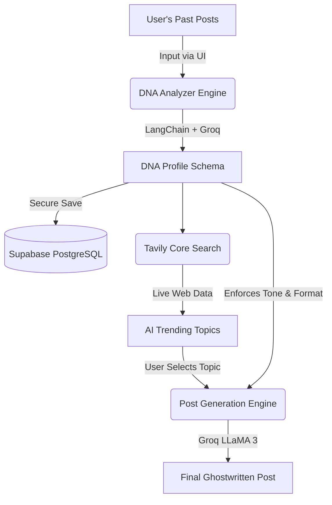

# 🧬 LinkedIn Post Generator AI

An advanced, end-to-end Agentic AI application designed to ghostwrite viral LinkedIn posts by perfectly mimicking a user's unique writing style. Built with a modern Node.js/Express backend, Vanilla JS frontend, LangChain, Groq LLMs, Tavily web search, and Supabase Authentication & PostgreSQL.

---

## 🚀 Features

- **Writing DNA Extraction**: Deeply analyzes your past LinkedIn posts to extract a strict JSON schema of your writing style (Tone, Hook Types, Emoji Frequency, Paragraph Sizing).
- **Real-Time Trend Analysis**: Uses the Tavily SDK to search the web for live, trending professional topics tailored specifically to your niche.
- **AI Ghostwriting**: Synthesizes your DNA profile with your chosen topic to generate a pixel-perfect, highly engaging LinkedIn draft in your exact voice.
- **Supabase Integration**: Fully secured by Supabase Auth (Email + Google OAuth) and automatically persists your DNA profile to a PostgreSQL database.
- **Beautiful Premium UI**: A highly responsive, glassmorphism-inspired dark mode interface.

---

## 🧠 The AI Workflow Architecture

Here is a visual representation of the application's data flow:



The application relies on a sophisticated 3-step AI pipeline using LangChain and Groq's high-speed inference (Llama 3 70B Versatile):

### 1. The DNA Analyzer
The user submits 3 to 10 of their past LinkedIn posts. The backend uses `withStructuredOutput` alongside Zod schemas to force the LLM to return a highly structured JSON profile. The AI evaluates the input and extracts granular details (e.g., "Conversational Tone", "Question-based Hooks", "Heavy Emoji Usage") and assigns a **Confidence Score** and **Reasoning** to every single extracted metric.

### 2. Trend-Aware Topic Generation
Once the DNA is extracted, the backend triggers the **Tavily Core SDK**. It searches the live web for trending topics related to the user's core subjects. The LLM then correlates these live web results with the user's DNA profile to suggest 5 to 10 highly relevant post topics, complete with match confidence scores.

### 3. Precision Post Drafting
The user selects an AI-generated topic or inputs a custom one (with specific reasoning). The final LLM prompt is constructed by aggressively enforcing the rules from the DNA Profile (e.g., "You must use short paragraphs and precisely 3 emojis"). The LLM generates the final draft and intelligently appends 3-5 trending hashtags at the bottom.

---

## 🛠 Tech Stack

- **Backend**: Node.js, Express, TypeScript
- **Frontend**: HTML5, Vanilla CSS (Glassmorphism), Vanilla JavaScript
- **AI & Orchestration**: LangChain, Groq API (Llama 3)
- **Web Search**: Tavily SDK
- **Database & Auth**: Supabase (PostgreSQL + JWT Authentication)

---

## 🔌 API Reference

### 1. Get Configuration
Retrieves public Supabase configuration variables for the frontend client.
- **Endpoint**: `GET /api/config`
- **Auth Required**: No
- **Response**:
  ```json
  {
    "supabaseUrl": "https://xyz.supabase.co",
    "supabaseAnonKey": "eyJhbGciOiJIUzI1NiIsInR..."
  }
  ```

### 2. Analyze Posts (Extract DNA)
Analyzes an array of strings (LinkedIn posts) and returns the user's Writing DNA. Automatically upserts the resulting profile into the Supabase PostgreSQL database.
- **Endpoint**: `POST /api/analyze`
- **Auth Required**: Yes (`Bearer <JWT>`)
- **Request Body**:
  ```json
  {
    "posts": [
      "Here is my first post...",
      "Here is my second post..."
    ]
  }
  ```
- **Response**:
  ```json
  {
    "tone": { "value": "Informative", "confidence": 0.9, "reasoning": "..." },
    "hoop_type": { "value": "Question", "confidence": 0.85, "reasoning": "..." },
    "avg_words": { "value": 150, "confidence": 0.95, "reasoning": "..." },
    "emoji_frequency": { "value": "Low", "confidence": 0.8, "reasoning": "..." },
    "paragraph_size": { "value": "Short", "confidence": 0.9, "reasoning": "..." },
    "writing_type": { "value": "Story-telling", "confidence": 0.88, "reasoning": "..." },
    "topic": { "value": ["AI", "Leadership"], "confidence": 0.92, "reasoning": "..." }
  }
  ```

### 3. Generate Trending Topics
Generates a list of suggested post topics using Tavily live search data mapped against the user's DNA.
- **Endpoint**: `POST /api/topics`
- **Auth Required**: Yes (`Bearer <JWT>`)
- **Request Body**:
  ```json
  {
    "dnaProfile": { /* Full DNA Object returned from /api/analyze */ }
  }
  ```
- **Response**:
  ```json
  {
    "topics": [
      {
        "topic_title": "The Future of AI in Leadership",
        "reasoning": "Matches your interest in AI and trend data shows high engagement.",
        "confidence": 0.91
      }
    ]
  }
  ```

### 4. Generate Final Post Draft
Ghostwrites the final LinkedIn post by stringently following the DNA schema rules and incorporating the selected topic.
- **Endpoint**: `POST /api/generate`
- **Auth Required**: Yes (`Bearer <JWT>`)
- **Request Body**:
  ```json
  {
    "dnaProfile": { /* Full DNA Object */ },
    "topic": {
      "title": "The Future of AI in Leadership",
      "reasoning": "Focus on how managers can use AI to empower their teams.",
      "isCustom": true
    }
  }
  ```
- **Response**:
  ```json
  {
    "post": "Have you ever wondered how AI will reshape leadership? 🤔\n\nAs managers, we often focus on metrics, but the real power of AI lies in empowerment...\n\n#AgenticAI #Leadership #FutureOfWork"
  }
  ```

---

## 💻 Local Development Setup

1. **Clone the repository** and install dependencies:
   ```bash
   npm install --legacy-peer-deps
   ```

2. **Configure Environment Variables**:
   Create a `.env` file in the root directory:
   ```env
   PORT=3000
   GROQ_API_KEY="your_groq_api_key"
   TAVILY_API_KEY="your_tavily_api_key"
   SUPABASE_URL="https://your-project.supabase.co"
   SUPABASE_ANON_KEY="your_supabase_anon_key"
   ```

3. **Supabase Setup**:
   Ensure you have created a Supabase project and executed the following SQL in your Database to create the DNA mapping table:
   ```sql
   CREATE TABLE user_dna (
     id UUID PRIMARY KEY DEFAULT uuid_generate_v4(),
     user_id UUID REFERENCES auth.users(id) NOT NULL UNIQUE,
     dna_profile JSONB NOT NULL,
     created_at TIMESTAMP WITH TIME ZONE DEFAULT NOW(),
     updated_at TIMESTAMP WITH TIME ZONE DEFAULT NOW()
   );
   
   ALTER TABLE user_dna ENABLE ROW LEVEL SECURITY;
   CREATE POLICY "Users can manage their own DNA" ON user_dna FOR ALL USING (auth.uid() = user_id);
   ```

4. **Run the Application**:
   ```bash
   npm run dev
   ```
   Access the app at `http://localhost:3000`.
